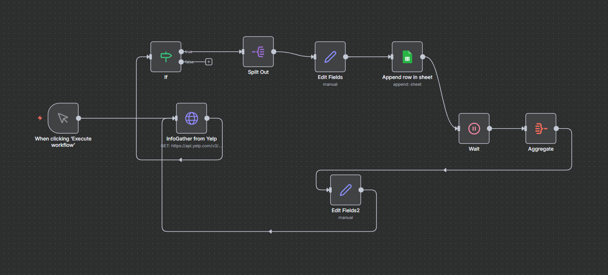

# 🍸 Business Lead & Owner Data Automation (Yelp-based)

## Overview
This project is an end-to-end business process automation built using **n8n**.  
It automatically collects bar and business information from Yelp, processes the data, and stores it in a structured format for business use cases like lead generation, outreach, and market research.

This workflow removes manual searching and data entry by creating a scalable and repeatable automation pipeline.

---

## 🚀 What This Automation Does

- Searches for bars by location using Yelp API  
- Extracts business details (name, address, phone, website)  
- Splits and processes each business record  
- Cleans and standardizes the data  
- Handles missing values  
- Exports structured data to Google Sheets  
- Supports pagination for large result sets  

---

## 🧠 Business Problem Solved

Manually collecting business and owner data from Yelp is slow, repetitive, and error-prone.  
This automation converts that manual process into a fully automated workflow that can generate large datasets in minutes.

---

## ⚙️ Tools & Technologies

- n8n (workflow automation)
- Yelp API
- HTTP Requests & JSON processing
- Conditional logic & data transformation
- Google Sheets integration

---

## 🗺 Workflow Architecture

Manual / Scheduled Trigger  
→ Yelp API Request  
→ Condition check  
→ Split businesses  
→ Field mapping & cleaning  
→ Export to Google Sheets

---

## 🛠 Key Features

- Modular workflow design  
- API integration  
- Pagination handling  
- Field validation  
- Business data structuring  
- Scalable automation flow  

---

## 📷 Workflow Screenshot

---

## 📈 Outcome

- Reduced manual effort drastically  
- Improved accuracy and consistency  
- Enabled scalable lead generation  
- Built a reusable business automation workflow  

---

### 🔹 Business Process Automations

- 🍸 Business Lead & Owner Data Automation (Yelp-based)  
  End-to-end n8n workflow that automates Yelp business data collection, enrichment, and export to Google Sheets.

## 👨‍💻 Author
Anil Samineni  
Business Process Automation | n8n | API Integrations | AI Agents

